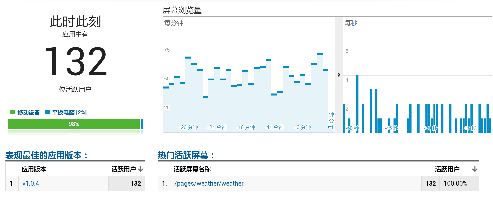
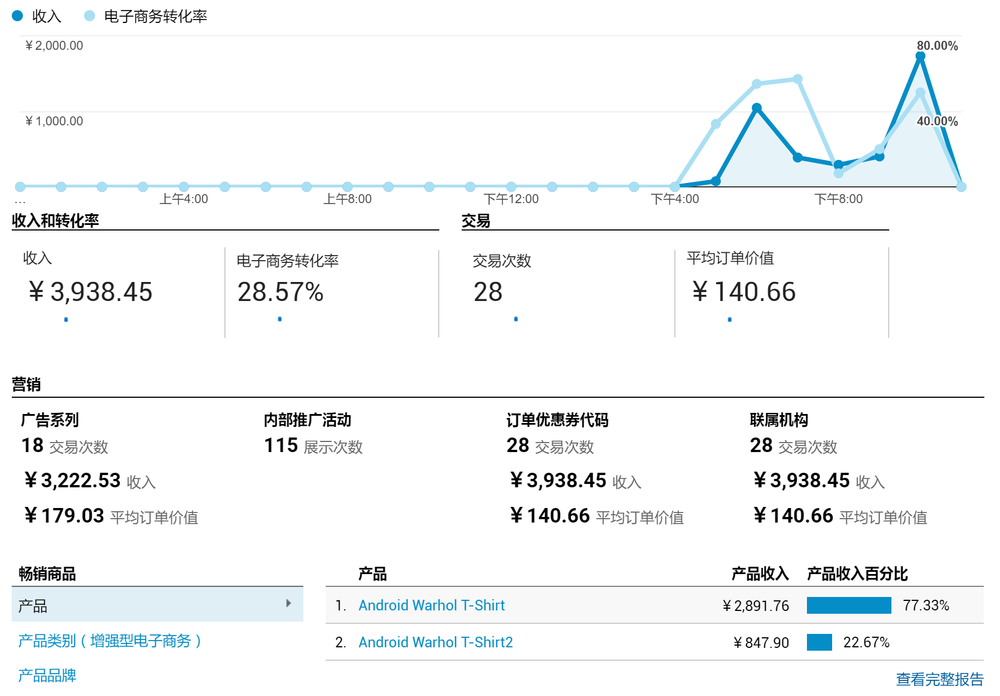
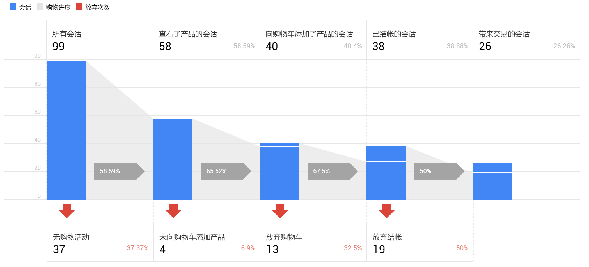

# 谷歌统计 (Google Analytics) SDK 微信小程序专用

Google Analytics SDK for Wechat's Mini Program

完整实现了 [Measurement Protocol](https://developers.google.com/analytics/devguides/collection/protocol/v1/reference)，并且API接口和 [Google Analytics for Android](https://developers.google.com/analytics/devguides/collection/android/v4/) 保持高度一致。

## 快速入门

#### 1. Google Analytics 设置

在账号下新建媒体资源，跟踪内容选 `移动应用` ,跟踪方法选 `Google Analytics（分析）服务 SDK`, 最后得到 `跟踪ID (Tracking ID)`

#### 2. 在你的微信小程序项目添加 `ga.js` 文件

#### 3. 在微信小程序后台设置request合法域名

把 `www.google-analytics.com` 添加到request合法域名中。对，就是每个月只能设置3次那个。

#### 4. 框架 `app.js` 中修改

```js
var ga = require('path/to/ga.js');
var GoogleAnalytics = ga.GoogleAnalytics;
App({
    // ...
    tracker: null,
    getTracker: function () {
        if (!this.tracker) {
            // 初始化GoogleAnalytics Tracker
            this.tracker = GoogleAnalytics.getInstance(this)
                            .setAppName('小程序名称')
                            .setAppVersion('小程序版本号')
                            .newTracker('UA-XXXXXX-X'); //用你的 Tracking ID 代替
        }
        return this.tracker;
    },
    // ...
})
```

#### 5. 找个`Page`来尝试一下简单的ScreenView统计

```js
var ga = require('path/to/ga.js');
var HitBuilders = ga.HitBuilders;
Page({
    // ...

    // 一般在onShow()里处理ScreenView
    onShow: function(){
        // 获取那个Tracker实例
        var t = getApp().getTracker();
        t.setScreenName('这是我的首屏页');
        t.send(new HitBuilders.ScreenViewBuilder().build());
    },
    // ...
})
```

#### 6. 去谷歌统计后台看一下 实时 > 概览

一切正常的话，几秒钟后就能看到数据了。


## 代码示例

### 跟踪器 Tracker

跟踪器用来收集数据并发送给谷歌统计服务器。跟踪器跟谷歌统计的媒体资源相对应，你可以创建多个跟踪器分别对应不同的媒体资源。

```js
var ga = require('path/to/ga.js');
var GoogleAnalytics = ga.GoogleAnalytics;

var app = getApp(); //获取微信小程序的App实例

// 初始化GoogleAnalytics
var gaInstance = GoogleAnalytics.getInstance(app);
gaInstance.setAppName('小程序名称'); // 设置APP名称
gaInstance.setAppVersion('小程序版本号'); //设置APP版本号，[可选]

// 创建一个跟踪器 Tracker
var tracker = gaInstance.newTracker('UA-XXXXXX-X'); // 参数是谷歌统计媒体资源中的 跟踪ID (Tracking ID)
```

多数情况下我们只需要用一个跟踪器，因此建议在 `app.js` 中全局共享一个跟踪器:

```js
// app.js
var ga = require('path/to/ga.js');
var GoogleAnalytics = ga.GoogleAnalytics;
App({
    // ...
    tracker: null,
    getTracker: function () {
        if (!this.tracker) {
            // 初始化GoogleAnalytics Tracker
            this.tracker = GoogleAnalytics.getInstance(this)
                            .setAppName('小程序名称')
                            .setAppVersion('小程序版本号')
                            .newTracker('UA-XXXXXX-X'); 
        }
        return this.tracker;
    },
    // ...
})
```

跟踪器的使用（一般在`Page`逻辑中）

```js
// /pages/index/index.js

Page({
    // ...
    onShow: function(){

        // 获取全局跟踪器
        var t = getApp().getTracker();

        // 后续的所有匹配数据都会使用这个屏幕名称。
        t.setScreenName('这是首页');

        // t.send(Hit) 上报数据
    },
    // ...
})


```

### 匹配构建 HitBuilder

用来构建一次匹配所需要的所有参数，`HitBuilder` 提供了所有匹配类型都需要的一些公共方法。   

一般不需要直接使用 `HitBuilder` , 请根据实际匹配类型使用下面的 `ScreenViewBuilder`, `EventBuilder`, `ExceptionBuilder`, `TimingBuilder`


### 屏幕 ScreenView

屏幕表示用户在您的小程序内查看的内容。

```js
var ga = require('path/to/ga.js');
var HitBuilders = ga.HitBuilders;
Page({
    // ...

    // 一般在onShow()里处理ScreenView
    onShow: function(){
        // 获取那个Tracker实例
        var t = getApp().getTracker();
        t.setScreenName('当前屏幕名称'); 
        t.send(new HitBuilders.ScreenViewBuilder().build());
    },
    // ...
})
```

支持自定义维度和指标（你需要在Google Analytics后台预先定义好）

```js
t.send(new HitBuilders.ScreenViewBuilder()
    .setCustomDimension(1,"纬度1")
    .setCustomDimension(2,"纬度2")
    .setCustomMetric(1,100.35)
    .setCustomMetric(2,200));
```

> **提醒：** 自定义纬度和指标在所有 `HitBuilder` 上都能设置。

### 事件 Event

事件可帮助你衡量用户与你的小程序中的互动式组件的互动情况，例如按钮点击等。  
每个事件由 4 个字段组成: **类别**，**操作**，**标签**和**值**。其中**类别**和**操作**这两个参数是必须的。

```js
t.send(new HitBuilders.EventBuilder()
    .setCategory('视频')
    .setAction('点击')
    .setLabel('播放') // 可选
    .setValue(1)); // 可选
```

### 崩溃和异常 Exception

你可以在小程序中把捕获到的异常信息进行统计。

```js
t.send(new HitBuilders.ExceptionBuilder()
    .setDescription('异常描述信息')  
    .setFatal(false)); // 可选，是否严重错误，默认为 true
```

### 用户计时 Timing

计时器有四个参数：**类别**，**值**，**名称**，**标签**。其中**类别**和**值**是必须的，**值**的单位是毫秒。

```js
t.send(new HitBuilders.TimingBuilder()
    .setCategory('计时器')
    .setValue(63000)
    .setVariable('用户注册')
    .setLabel('表单'));
```

### 会话管理

默认的会话时长是30分钟，可以在谷歌分析媒体资源一级进行设置。你也可以在发送匹配时使用 `setNewSession` 方法来手动开始一个新会话。

```js
// Start a new session with the hit.
t.send(new HitBuilders.ScreenViewBuilder()
    .setNewSession()
    .build());
```

> **提醒：** 所有 `HitBuilder` 都支持手动开始新会话。

### 用户ID （跨应用，跨设备跟踪）

User ID用来进行跨应用和跨设备的同一用户跟踪，比如你可以把小程序用户的 <del>`OpenID` 或</del> `UnionID` 设置为 User ID。

> **你需要先在谷歌分析后台的媒体资源里面启用User ID跟踪功能。**

要发送 User ID，请使用 `Measurement Protocol & 号语法` 和 `&uid` 参数名称来设置 `userId` 字段，如下例所示：

```js
  // You only need to set User ID on a tracker once. By setting it on the
  // tracker, the ID will be sent with all subsequent hits.
  t.set("&uid", '12345');

  // This hit will be sent with the User ID value and be visible in
  // User-ID-enabled views (profiles).
  t.send(new HitBuilders.EventBuilder()
      .setCategory("UX")
      .setAction("User Sign In")
      .build());
```

上面代码用到了 `&uid` 参数，所有 `Measurement Protocol & 号语法` 支持的参数可以去 [Measurement Protocol 参数参考](https://developers.google.com/analytics/devguides/collection/protocol/v1/parameters) 查看。

> **提醒：** 这些 `&uid` 参数可以在 `Tracker` 级别设置，也可以在 `HitBuilder` 的单次匹配上设置。

## 电子商务活动相关

请查看[衡量电子商务活动](doc/ecommerce.md)

## 广告系列和流量来源归因

你可以使用 `setCampaignParamsFromUrl` 方法在匹配构建器 `HitBuilder` 中直接设置广告系列参数，以便将一系列会话中的用户活动归因到特定的引荐流量来源或营销广告系列：

```js
// Set screen name.
t.setScreenName(screenName);

// In this example, campaign information is set using
// a url string with Google Analytics campaign parameters.
// Note: 这只是示例，网址 ? 前面部分其实没有用处，主要是utm_XXXXX系列参数的解析
//
var campaignUrl = "http://example.com/index.html?" +
    "utm_source=email&utm_medium=email_marketing&utm_campaign=summer" +
    "&utm_content=email_variation_1";

// Campaign data sent with this hit.
t.send(new HitBuilders.ScreenViewBuilder()
    .setCampaignParamsFromUrl(campaignUrl)
    .build()
);
```

> **重要提醒：** 如果你想跟踪广告带来的新用户，那么一定要保证 `setCampaignParamsFromUrl` 应用在该新用户发送的第一个匹配上。

你也可在跟踪器上通过 `setCampaignParamsOnNextHit` 设置：

```js
t.setScreenName(screenName);
var campaignUrl = "http://example.com/index.html?" +
    "utm_source=email&utm_medium=email_marketing&utm_campaign=summer" +
    "&utm_content=email_variation_1";
t.setCampaignParamsOnNextHit(campaignUrl); // 下一个发送的匹配会带上这些参数

t.send(new HitBuilders.ScreenViewBuilder().build());
```

### 跟踪微信小程序的二维码参数

每个微信小程序可以设置多达10万个自定义参数的二维码，下面介绍如何跟踪每个二维码的推广效果。

> 微信小程序自定义参数的二维码需要通过API来生成，参考[微信文档](https://mp.weixin.qq.com/debug/wxadoc/dev/api/qrcode.html)。

假设你生成二维码时用的 `path` 是 
```js
{"path": "pages/index/index?utm_source=Coffee%20Bar&utm_medium=qrcode", "width": 430}

// path 一般是你小程序的入口页，也可以是 App 上注册过的 pages 中的一个
```

在对应 `Page` 的 `onLoad` 里面用 `CampaignParams.parseFromPageOptions` 识别二维码中的广告参数：

```js
// pages/index/index.js
var ga = require('path/to/ga.js');
var CampaignParams = ga.CampaignParams;

Page({
    //...
    onLoad: function(options) {
        var t = getApp().getTracker();
        // 解析options中的 utm_xxxxxx 参数，生成一个广告连接 URL
        var campaignUrl = CampaignParams.parseFromPageOptions(options).toUrl();
        t.setCampaignParamsOnNextHit(campaignUrl);

        // 下一个发送的匹配就会带上广告来源信息
        // t.send(Hit) 
    },
    //...
})
```

如果 `path` 的参数不是 `utm_` 开头的广告系列参数，那么调用 `parseFromPageOptions` 的时候需要第二个参数指定一个参数映射关系：

```js
{"path" : "pages/index/index?var1=Coffee%20Bar&var2=Scan%20Qrcode", "width": 430}


// 扫码进入小程序后 
Page({
    onLoad: funciton(options) {
        // 此时 options 是这样的 
        // { "var1" : "Coffee Bar", "var2" : "Scan Qrcode" }
        // 需要指定和 utm_xxx 的映射关系
        var map = {
            "var1" : "utm_source", // 把 var1 对应到  utm_source
            "var2" : "utm_medium"
        };

        var campaignUrl = CampaignParams.parseFromPageOptions(options, map).toUrl();
        var t = getApp().getTracker();
        t.setCampaignParamsOnNextHit(campaignUrl);
    }
})

```

广告系列参数列表

| 参数 |	说明 |	示例 |
| --- | --- | --- |
| `utm_source` |	广告系列来源，用于确定具体的搜索引擎、简报或其他来源	| utm_source=google |
| `utm_medium`	| 广告系列媒介，用于确定电子邮件或采用每次点击费用 (CPC) 的广告等媒介	| utm_medium=cpc |
| `utm_term` |	广告系列字词，用于付费搜索，为广告提供关键字	| utm_term=running+shoes |
| `utm_content` |	广告系列内容，用于 A/B 测试和内容定位广告，以区分指向相同网址的不同广告或链接	| utm_content=logolink<br/>utm_content=textlink |
| `utm_campaign` |	广告系列名称，用于关键字分析，以标识具体的产品推广活动或战略广告系列	| utm_campaign=spring_sale |

查看全部[广告系列参数](https://developers.google.com/analytics/devguides/collection/android/v4/campaigns#campaign-params)。

## API参考

所有接口直接参考Google Analytics SDK for Android，可以直接查看对应API文档。

[GoogleAnalytics](doc/GoogleAnalytics.md)

跟踪器

* [Tracker](https://developers.google.com/android/reference/com/google/android/gms/analytics/Tracker.html#enableAdvertisingIdCollection(boolean))

匹配构建

* [HitBuilder](https://developers.google.com/android/reference/com/google/android/gms/analytics/HitBuilders.HitBuilder)
* [ScreenViewBuilder](https://developers.google.com/android/reference/com/google/android/gms/analytics/HitBuilders.ScreenViewBuilder)
* [EventBuilder](https://developers.google.com/android/reference/com/google/android/gms/analytics/HitBuilders.EventBuilder)
* [ExceptionBuilder](https://developers.google.com/android/reference/com/google/android/gms/analytics/HitBuilders.ExceptionBuilder)
* [TimingBuilder](https://developers.google.com/android/reference/com/google/android/gms/analytics/HitBuilders.TimingBuilder)

增强型电子商务API

* [Product](https://developers.google.com/android/reference/com/google/android/gms/analytics/ecommerce/Product)
* [ProductAction](https://developers.google.com/android/reference/com/google/android/gms/analytics/ecommerce/ProductAction)
* [Promotion](https://developers.google.com/android/reference/com/google/android/gms/analytics/ecommerce/Promotion)

## 功能特点

* 完整实现 [Measurement Protocol](https://developers.google.com/analytics/devguides/collection/protocol/v1/reference)
* 支持多个匹配数据批量上报
* 因为微信小程序只支持5个`wx.request`并发，为了不影响业务数据的网络请求，数据上报的时候按顺序进行，最多占用一个`wx.request`

## 已知问题

1. 因为微信小程序能获取的系统信息很有限，将无法获取 `年龄`，`性别`，`兴趣` 这些用户特征信息。
2. 展示广告功能无效
3. 屏幕分辨率有误差。通过微信小程序`wx.getSystemInfo`获取`windowWidth`,`windowHeight`,`pixelRatio`计算得到。

> **其他可能的问题**
>
> 如果控制台出现`"ga:failed"`,内容为`errMsg:"request:fail 小程序要求的 TLS 版本必须大于等于 1.2"`  
> 在翻墙的时候碰到了这个问题，不翻墙时正常。
>
>
> 你可以通过控制台找 "ga.****" 的那些信息查看。

## 参考资料

协议 [Measurement Protocol](https://developers.google.com/analytics/devguides/collection/protocol/v1/reference)  
接口参照 [Google Analytics for Android](https://developers.google.com/analytics/devguides/collection/android/v4/)   
[广告系列参数](https://developers.google.com/analytics/devguides/collection/android/v4/campaigns#campaign-params)


## 效果截图





